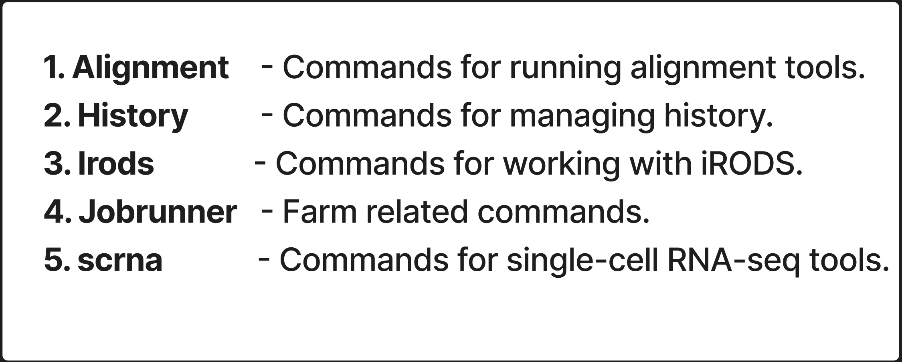

[](https://github.com/haniffalab/solosis/actions/workflows/tests-python.yml)
[](https://github.com/haniffalab/solosis/actions/workflows/precommit.yml)
[](https://codecov.io/github/haniffalab/solosis)
[](https://haniffalab.github.io/solosis)

# Solosis


<!-- PROJECT LOGO -->
<br />
<div align="center">
  <a href="https://github.com/haniffalab/solosis">
    
  </a>

<h1 align="center">solosis</h1>

  <p align="center">
    A plug and play pipeline for the lab - made to work with farm22.
    <br />
    <br />
    <a href="https://github.com/haniffalab/solosis/issues">Report Bug</a>
    &middot;
    <a href="https://github.com/github_username/solosis/issues/new?labels=enhancement&template=feature-request---.md">Request Feature</a>
    <br />
    <br />
    <a href="https://haniffalab.github.io/solosis">
        
    </a>

  </p>
</div>


<!-- TABLE OF CONTENTS -->
<details>
  <summary>Table of Contents</summary>
  <ol>
    <li><a href="#Point-of-Contact">Point of Contact</a></li>
    <li><a href="#Features">Features</a></li>
    <li>
      <a href="#getting-started">Getting Started</a>
      <ul>
        <li><a href="#installation">Installation</a></li>
        <li><a href="#setup">Setup</a></li>
        <li><a href="#Tutorials">Tutorials</a></li>
      </ul>
    </li>
    <li><a href="#usage">Usage</a></li>
  </ol>
</details>

<!-- Point of contact -->
## Point of Contact:

### Haniffa Lab
Vijay Baskar Mahalingam Shanmugiah- *vm11@sanger.ac.uk*

Dave Horsfall- *dh21@sanger.ac.uk*

Louise Grimble- *lg28@sanger.ac.uk*


<!-- Features -->
## Features 

<div align="center">
  <a href="https://github.com/haniffalab/solosis">
    
  </a>
</div>

*1. Alignment*
 - cellranger-count (GEX)
 - cellranger-arc-count (GEX & ATAC)
 - cellranger-vdj (Immune profiling BCR/TCR)

*2. History*
 - view (Look up recently executed solosis commands)
 - uid (Look up individual executed solosis commands for logs and errors)
 - clear (Remove history of executed solosis commands)

*3. Irods*
 - iget-cellranger (Download cellranger outputs from irods)
 - iget-fastqs (Run nf-irods-to-fastq pipeline from CellgenIT to download fastqs onto farm)
 - imeta-report (Create a report of data available on irods for specific samples)

*4. Jobrunner*
 - run_notebook (Run a jupyter notebook on the farm)
 - submit_job (Run a single command on the farm)

*5. scrna*
 - cellbender (Run cellbender remove-background)
 - scanpy (Basic QC notebook)
 - merge-h5ad (Merge h5ad objects into unified object)

<!-- GETTING STARTED -->
## Getting Started

### Installation
**1. load the solosis module on Farm:**

   ```sh
   module load cellgen/solosis
   ```

<!-- Tutorials -->
### Tutorials
1. Sphinx [Documentation](https://haniffalab.github.io/solosis) (External Sanger user)


2. Notion [Documentation](https://www.notion.so/haniffalab/Solosis-86fec351478140b6b75e375cafccfaaf) (Haniffa lab user)


<!-- USAGE EXAMPLES -->
# Usage
1. Execute the base command:

    ```sh
    ./solosis-cli
    ```
    
    ```sh
    Usage: solosis-cli [OPTIONS] COMMAND [ARGS]...

    Options:
    --debug  Enable debug mode
    --help   Show this message and exit.

    Commands:
    alignment  Commands for running alignment tools.
    history    Commands for managing history.
    irods      Commands for working with iRODS.
    jobrunner  Farm related commands
    scrna      Commands for single-cell RNA-seq tools.
    ```


# Leaving here for now 

pip-compile --output-file=envs/requirements.txt
pip-compile --extra=dev --output-file=envs/dev-requirements.txt
pip-compile --extra=dev --output-file=envs/doc-requirements.txt

pip-sync envs/requirements.txt
pip-sync envs/dev-requirements.txt
pip-sync envs/doc-requirements.txt
