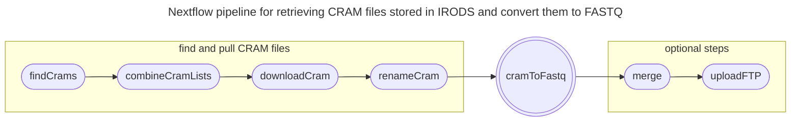

# nf-irods-to-fastq
This Nextflow pipeline pulls samples from iRODS and converts them to FASTQ files.

## Contents of Repo
* `main.nf` - the Nextflow pipeline that pulls the samples and converts them.
* `nextflow.config` - the configuration script that controls the cluster scheduler, process and container.
* `examples/samples.csv` - an example samples.csv file, contains one colum with sample names (header 'sample' is required).
* `examples/run.sh` - an example run script that executes the pipeline.

## Pipeline Arguments
* `--meta`: A metadata CSV with the sample IDs, and possibly other iRODS parameters. Header relevant, as specifies iRODS metadata field names (required)
* `--publish_dir`: Path to put the output filess of the pipeline. (default `'results'`)
* `--type`: Other potential arguments, though not mandatory. If ATAC, set this to 'ATAC' (default `null`)
* `--index_format`: index-format formula for samtools, only if you really know what you're doing (default `"i*i*"`)
* `--publish_fastqs`: Whether to publish fastqs - other workflows using this may not want to (default `true`)
* `--find_crams_only`: For advanced CRAM list manipulation. Only return the found SAMPLE,CRAM list, e.g. for manual curation/manipulation (default `false`)
* `--cram_list`: Accept SAMPLE,CRAM list on input (default `null`)
* `--merge`: Concatenate FASTQ files for samples with multiple lanes or sample numbers. Only one R1, R2 (and optionally R3) will be generated per each sample. (default `false`)
* `--ftp_upload`: Upload the resulting files to an FTP (default `false`).
  *   Use in combination with `--ftp_credenials`, `--ftp_host` and `--ftp_path`.

## Graph

